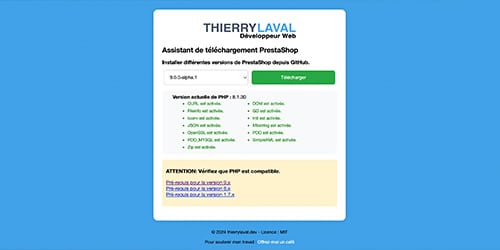

# 

## Auteur

👤 &nbsp; **Thierry LAVAL** [🇫🇷 Contactez moi 🇬🇧](<contact@thierrylaval.dev>)

* Github: [@Thierry Laval](https://github.com/thierry-laval)
* LinkedIn: [@Thierry Laval](https://www.linkedin.com/in/thierry-laval)
* Visitez ==> 🏠 [Site Web](https://thierrylaval.dev)

***

### 📎 Projet 37 - Création d'un installateur de version de Prestashop

_`Début du projet le 27/11/2023`_

***

## Assistant de téléchargement PrestaShop

### Description

Ce script PHP a été créé pour aider les développeurs à travailler plus efficacement avec PrestaShop. Il offre une fonctionnalité de téléchargement automatique des différentes versions de PrestaShop depuis le référentiel GitHub officiel, ce qui réduit le temps et les efforts nécessaires pour installer PrestaShop.

### Fonctionnalités du script

* **Versions de PrestaShop** : Affiche toutes les versions disponibles sur GitHub.
* **Téléchargement automatique** : Télécharge la version sélectionnée en un clic.
* **Décompression automatique** : Décompresse l'archive téléchargée.
* **Vérification PHP** : Vérifie la compatibilité de votre version PHP avec PrestaShop.
* **Lancement de l'installation** : Redirige vers `index.php` pour initier l'installation.

### Étapes d'installation

1. Téléchargez le script.
2. Installez-le à la racine de votre dossier de domaine ou sous-domaine.
3. Accédez à votre site via votre navigateur.
4. Suivez les instructions pour configurer et installer PrestaShop.

### 📦 &nbsp; Utilisé dans ce projet

|  Langages  |  et Applications   |
|:----------:|:------------------:|
|   HTML5    | Visual Studio Code |
|    CSS3    |     Git/GitHub     |
|     PHP    |                    |

***

#### Les contributions sont les bienvenues !

Suivez les étapes suivantes :

* Fork du projet
* Créez une nouvelle branche (git checkout -b feature/ajout-fonctionnalite)
* Commit de vos modifications (git commit -am 'Ajout d'une nouvelle fonctionnalité')
* Push vers la branche (git push origin feature/ajout-fonctionnalite)
* Ouvrez une Pull Request

#### 📝 &nbsp; License

Ce projet est sous licence [MIT](LICENCE).

Copyright © 2024 [Thierry Laval](https://thierrylaval.dev)

#### €€€ Soutien

Si vous appréciez ce projet, vous pouvez me soutenir : 

[Voir mon travail](https://github.com/thierry-laval)

[Créer un bon template](https://github.com/thierry-laval/P22-template-pour-un-readme)

***

### &hearts;&nbsp;&nbsp;&nbsp;&nbsp;Love Markdown

Donnez une ⭐️ &nbsp; si ce projet vous a plu !

FAN DE GITHUB !

<!-- [This is an image](https://myoctocat.com/assets/images/base-octocat.svg) -->

**[⬆ Retour en haut](#auteur)**  